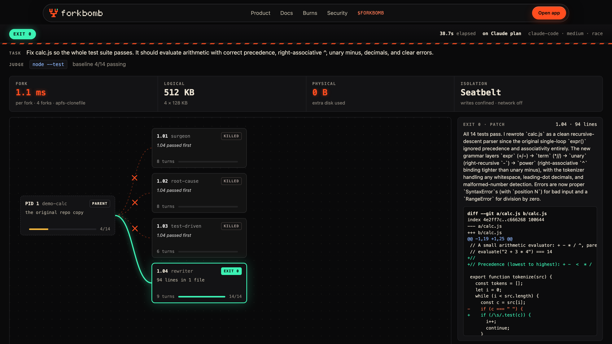
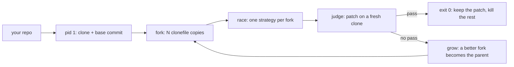

<div align="center">

<a href="https://forkbomb.fun"></a>

<h1>Forkbomb</h1>

<p><strong>Fork your coding agent. Kill the losers. Keep the patch that passes.</strong></p>

<p>
  <a href="https://github.com/plvgger/forkbomb/actions/workflows/ci.yml"></a>
  <a href="LICENSE"></a>
  
  
</p>

<p>
  <a href="https://forkbomb.fun">Website</a> ·
  <a href="https://forkbomb.fun/docs">Docs</a> ·
  <a href="https://forkbomb.fun/replay">Watch a run</a> ·
  <a href="https://forkbomb.fun/security">Security</a>
</p>

<a href="https://forkbomb.fun/replay"></a>

</div>

<br>

Retry a coding agent and it tends to fail the same way twice. Forkbomb forks it instead.

One run becomes N sandboxed copies of your repo, cloned in milliseconds, each driven by a different strategy. They race. Your test suite judges the patch each fork would ship, on a fresh clone. The first fork to pass exits 0, the rest are killed, and the winning patch is yours.

| **45 ms** | **22 MB** | **14/14 · 38.7 s** | **$0.09** |
|:-:|:-:|:-:|:-:|
| per fork, 80 MB `node_modules` (copy: 1,108 ms) | extra disk for 16 forks (copy: 1.3 GB) | recorded race, 4 forks, from 4/14 | first hosted race, 4 forks, 14/14 |

Fork time scales with file count: the 14-test demo repo forks in 1.1 ms. Up to 64 forks per round, up to 10 rounds.

## Quickstart

Needs macOS on APFS, Node 22+, Xcode Command Line Tools (`xcode-select --install`), and either Claude Code logged in with a Pro or Max plan (`claude auth login`) or an Anthropic API key. Forkbomb is not on npm yet. Run it from source:

```sh
git clone https://github.com/plvgger/forkbomb
cd forkbomb
npm install && npm run build && npm link
forkbomb doctor
```

Race the bundled demo. `examples/calc` is the repo from the [recorded race](#a-recorded-race): 14 tests, 10 failing.

```sh
forkbomb run ./examples/calc \
  --task "fix the failing tests" \
  --test "node --test" \
  --forks 4 --ui
```

`--ui` opens the live process tree. The first run on each Claude Code version starts with the [isolation canary](#engines), which takes about a minute. Then point it at your own repo:

```sh
forkbomb run ../my-repo --task "fix the date parser" --test "npm test" --forks 8 --apply
```

`--apply` writes the winning patch into your repo. Without it, the patch waits in `~/.forkbomb/runs/<id>/winner.patch`. To pay per token instead of using your plan, put `ANTHROPIC_API_KEY=...` in `~/.forkbomb/.env` and add `--engine api`.

## How it works



1. **Fork.** Forkbomb clones your repo once into pid 1 and commits a base snapshot. It then forks pid 1 into N copies with `clonefile(2)`. On APFS a clone shares every data block with its parent until a fork writes, so a fork costs metadata, not a copy.
2. **Race.** Each fork is a coding agent with a shell and a file editor, sealed in its own clone, working the task its own way: `surgeon`, `root-cause`, `test-driven`, `rewriter`, `skeptic` and seven more. Eight copies of one strategy fail the same way eight times. Diversity is the point.
3. **Judge.** When a fork stops, Forkbomb diffs it against the base, drops every change to protected files (tests, test config, setup files, manifests, lockfiles, and any script your test command runs), applies the rest to a fresh clone of pid 1 and runs your test command there, sandboxed. A fork is judged by the patch it would ship. Edits to ignored files and planted tests never count. A clean exit with fewer tests than the baseline is not a pass.
4. **Kill.** In `race` mode the first fork to pass the full suite exits 0 and the rest are killed mid-thought. In `best` mode every fork finishes and the smallest passing diff wins.
5. **Grow.** If no fork passes and the round's best fork beat its parent, that fork's verified state (pid 1 plus its patch) becomes the parent of the next round, along with where it left off and the tail of its last test run. Otherwise the next round forks the same parent again, with the next strategies in the rotation.

<details>
<summary><strong>The 12 strategies</strong></summary>

<br>

Forks take strategies in order, and the rotation continues across rounds.

| Strategy | Brief |
|---|---|
| `surgeon` | Make the smallest change that could possibly work. |
| `root-cause` | Read every file involved first, find the underlying cause, fix it once. |
| `test-driven` | Run the tests first and let the failure output drive every step. |
| `rewriter` | If the code at fault is tangled, rewrite the function or module cleanly. |
| `skeptic` | Assume the obvious fix is wrong. Hunt for edge cases the tests imply. |
| `cartographer` | Find every caller and related definition before changing anything. |
| `sprinter` | Make a quick attempt, run the tests, iterate on what they say. |
| `spec-first` | Write down the exact behaviour each test expects, then implement to it. |
| `bisector` | Isolate one failing test at a time and fix it completely. |
| `minimalist` | Prefer deleting or simplifying code over adding more. |
| `tracer` | Observe what the code actually does with prints or a scratch script, then fix. |
| `contrarian` | Pick an approach different from the first one that comes to mind. |

Source: [`src/strategies.ts`](src/strategies.ts).

</details>

## Proof

### Forking costs metadata, not a copy

`forkbomb bench` forks the same workspace with `clonefile` and with a plain recursive copy. MacBook Air (M2, 24 GB), an 80 MB `node_modules` tree of 4,400 files, 16 forks:

| Forker | Per fork | Logical | Extra disk |
|---|--:|--:|--:|
| `apfs-clonefile` | **45 ms** | 1.2 GB | **22 MB** |
| `copy` | 1,108 ms | 1.2 GB | 1.3 GB |

About 24× faster and 60× less disk. Measure your own repo with `forkbomb bench ./my-repo --forks 16`. Extra disk is free space before minus free space after, so other activity on the machine shows up as noise.

### A recorded race

Run `20261005-155223`: Claude Code on a Max plan, the `examples/calc` repo, `node --test`, baseline 4 of 14 passing. Four forks, `race` mode.

| Fork | Strategy | Fork time | Turns | Tool calls | Result |
|---|---|--:|--:|--:|---|
| 1.01 | `surgeon` | 0.97 ms | 8 | 5 | killed |
| 1.02 | `root-cause` | 1.46 ms | 8 | 5 | killed |
| 1.03 | `test-driven` | 1.05 ms | 6 | 3 | killed |
| **1.04** | **`rewriter`** | 1.03 ms | 9 | 5 | **exit 0 · 14/14 · 94-line patch** |

The CLI's narration of that run, rendered from its event log:

```text
   0.7s  run 20261005-155223: 4 forks × 2 rounds · claude-code (medium) · race · sandbox on · on your Claude subscription
   1.1s  baseline: 4 passing, 10 failing (exit 1)
   1.1s  fork  4 × pid 1 in 1.13 ms each via apfs-clonefile · 512 KB logical, 0 B physical
  38.2s    1.04 done: end_turn after 9 turns
  38.5s    1.04 PASS 14/14 · 94 lines
  38.5s    1.01 killed (1.04 passed first)
  38.5s    1.02 killed (1.04 passed first)
  38.5s    1.03 killed (1.04 passed first)
  38.7s  round 1: best 1.04 at 100%
  38.7s  EXIT 0 1.04: 94 lines in 1 file. All 14 tests pass.
  38.7s  done in 38.7s · patch: ~/.forkbomb/runs/20261005-155223/winner.patch
```

Watch every tool call at **[forkbomb.fun/replay](https://forkbomb.fun/replay)**. The [event log](web/public/replay/events.jsonl) and the [winning patch](web/public/replay/winner.patch) are in the repo. The patch applies to `examples/calc` and passes 14/14. Event names and paths in the published log were updated to the current schema after the run; every number is as recorded.

### On the hosted engine

Run `20261007-015122`, the first race on the hosted GPU pool: `--engine hosted`, the same `examples/calc` repo, 4 forks cloned in 0.40 ms each, `race` mode. Fork 1.03 (`test-driven`) passed 14/14 with a 92-line patch and the other three were killed. The race took 4 min 33 s and was billed $0.09 of test credit granted by the operator, since burns open at launch. (The CLI of that day printed $0.06: it left out the killed forks' last turns, which it now counts.)

The [event log](docs/runs/20261007-015122/events.jsonl) and the [winning patch](docs/runs/20261007-015122/winner.patch) are in the repo, updated to the current schema the same way. `forkbomb replay docs/runs/20261007-015122` plays it back.

## Engines

The engine decides where the model runs and who pays for it. Whichever you pick, every shell command runs on your machine, under the sandbox.

| Engine | Flag | Model | Who pays | Status |
|---|---|---|---|---|
| Claude Code | `--engine claude-code` (default) | A headless Claude Code session per fork | Your Claude Pro or Max plan | Live |
| Anthropic API | `--engine api` | Forkbomb's tool loop on the Messages API. Default `claude-opus-5-5` at `medium` effort | Your `ANTHROPIC_API_KEY`, pay as you go | Live |
| Hosted | `--engine hosted` | The same tool loop on the forkbomb.fun gateway (OpenAI-compatible), model `forkbomb-hosted` | Credit from burning $FORKBOMB | GPU pool live. Credit opens when $FORKBOMB launches |

- **Claude Code.** Forks count against your plan's usage limits; eight forks use them about eight times as fast as one session. `--max-turns` caps each session. Before the first run on each Claude Code version, Forkbomb runs an isolation canary: a real session told to escape. Forks start only if the session tried every escape and each one failed. A session that skips a step proves nothing, so that canary counts as inconclusive and nothing is cached. Run it any time with `forkbomb canary`.
- **API.** The key comes from `ANTHROPIC_API_KEY` or `~/.forkbomb/.env`, and is checked once before any fork starts. Pick the model with `--model` and the effort with `--effort`.
- **Hosted.** Put a workspace key in `FORKBOMB_API_KEY`. `FORKBOMB_HOSTED_URL` overrides the gateway (default `https://forkbomb.fun/api/v1`). `forkbomb credits` shows the balance and pricing. The gateway picks the model, so `--model` is ignored. When credit runs out mid-run, no fork makes another call. A killed fork's last turn is still billed for what it streamed, after it hangs up; the run's cost includes it, estimated the way the gateway bills it and then checked against your balance once it settles.

Keys stay on your machine. The Anthropic key goes only to Anthropic, the hosted key only to the gateway, and no key ever reaches a fork. Self-hosting stays free.

## Isolation

Every fork is treated as hostile. A fork is a model running tools on your machine, and anything it reads can steer it: a README, a code comment, a dependency's install output. Forkbomb limits what a steered fork can reach.

| Layer | Enforced |
|---|---|
| Writes | Only the fork's clone and its private temp dir. |
| `.git` | Read-only for forks. Only the judge writes it. |
| Reads | `api` and `hosted`: nothing under `~` or the runs folder except the clone, its temp dir and toolchain folders (`.nvm`, `.cargo`, `.pyenv`, …), so other forks and other runs stay private wherever `FORKBOMB_HOME` or `--runs-dir` puts them. `claude-code`: a deny list covering SSH, cloud and CLI credentials, every `.env` key file in `~` and its dot-folders, Keychains, shell history, app data, Desktop, Documents and Downloads. |
| Network | Loopback only: connections to any other address are refused, by IP as well as by name, and the system DNS resolver is blocked. `--network` opts in on `api` and `hosted`. `claude-code`: no outbound network, WebFetch and WebSearch denied. `forkbomb doctor` checks it. |
| Environment | Allowlisted. No API keys or tokens reach a fork. |
| Editor | Every path is re-checked: no `..`, no symlinks out of the clone or into `.git`, no writes through hard links. |
| Commands | A timeout and an output cap on every command, 1 GiB per file and a cap on new processes. Background children die with it. Ctrl-C stops every fork and everything it started, and exits 130. |
| Claude Code | `--safe-mode`, no user or project settings (no CLAUDE.md, hooks, plugins or MCP), Claude Code's own Bash sandbox, permission rules on the file tools, and the canary before first use. |
| Judge | Runs under Forkbomb's own Seatbelt profile on every engine. Every git call on a fork's clone is sandboxed too. Edits to tests, test config, setup files and scripts the test command runs are dropped. |

**Limits, stated plainly.** Seatbelt is a macOS mechanism, not a VM: forks share your kernel and your user account. System paths and anything outside `~` and the runs folder (other volumes, `/Users/Shared`, `/opt`) are readable on every engine, and on `claude-code` so is anything under `~` that isn't on the deny list. There are no CPU or memory limits, and disk use is capped per file, not per fork: the run stops every fork if the disk is about to fill up. The judge resists the common ways to game a test suite, not every one: the code under test runs inside the test process, so a patch that special-cases your tests' exact inputs, or patches the assertion library from a source file, will pass. Read the winning patch. `--no-sandbox` exists for development and is not safe. `--engine hosted` sends the task, the code forks read and tool output through the gateway. Run Forkbomb on code you'd let an agent work on.

The full threat model is at [forkbomb.fun/security](https://forkbomb.fun/security). Reporting and scope: [SECURITY.md](SECURITY.md).

## Burn for compute

$FORKBOMB has not launched. The hosted GPU pool is live, and credit to spend on it opens when the token launches. The mechanism, as built:

1. **Create a workspace** at [forkbomb.fun/app](https://forkbomb.fun/app) and take its API key.
2. **Burn with a memo.** Burn $FORKBOMB in a transaction whose memo is exactly `forkbomb:<workspaceId>`.
3. **Verified on-chain.** The server reads the finalized transaction back from Solana and checks the mint, the burn and the memo. Credit never comes from what a client says.
4. **Priced at burn time.** The burn is valued in USD from price samples around its block time. The most conservative price wins.
5. **Spent per token.** That value becomes credit on the workspace, debited per token on the hosted gateway. Each request reserves its worst case first, and the balance never goes below zero.
6. **Public ledger.** Every verified burn is listed at [forkbomb.fun/burns](https://forkbomb.fun/burns). Each signature is credited once.

> [!NOTE]
> Credit is consumptive. It has no cash value and is non-refundable and non-transferable. Burns are final. $FORKBOMB pays for hosted compute and is not an investment. Self-hosting with Claude Code or an Anthropic API key never needs it. See the [token page](https://forkbomb.fun/token) and the [terms](https://forkbomb.fun/terms).

## Commands

From a source checkout without `npm link`, run `node dist/cli.js` in place of `forkbomb`.

```text
forkbomb run [repo] --task "..." --test "cmd"   race forks on a repo
forkbomb bench [dir] --forks 16                 clonefile vs copy, measured
forkbomb replay <run-dir>                       replay a recorded run in the browser
forkbomb export <run-dir> <out-dir>             static replay you can host anywhere
forkbomb doctor                                 check the machine
forkbomb credits                                hosted credit balance and pricing
forkbomb canary                                 prove Claude Code forks can't escape
```

`forkbomb <command> --help` shows one command's options. `export` replaces local paths (your home folder, the run folder, where the repo lives) before it writes anything.

Key `run` flags:

| Flag | Default | What it does |
|---|---|---|
| `--forks N` | `8` | Forks per round, 1 to 64 |
| `--rounds N` | `2` | Rounds, each grown from the best fork so far, up to 10 |
| `--mode race\|best` | `race` | First full pass wins, or every fork finishes and the smallest passing diff wins |
| `--engine NAME` | `claude-code` | `claude-code`, `api` or `hosted` |
| `--model ID` | engine default | Model for the forks (`api` default: `claude-opus-5-5`) |
| `--effort LEVEL` | `medium` | `low`, `medium`, `high`, `xhigh` or `max` |
| `--apply` | off | Apply the winning patch to your repo |
| `--ui` | off | Live process tree in the browser, on port 4317 |
| `--protect GLOB` | | Extra read-only path for forks, repeatable |
| `--network` | off | Outbound network for forks (`api` and `hosted`) |
| `--keep-forks` | off | Keep killed forks' clones on disk |

Also `--max-turns` (30), `--fork-timeout` (600 s), `--bash-timeout` (120 s), `--test-timeout` (300 s), `--concurrency` (8) and `--runs-dir`. `forkbomb --help` lists every flag. A test command that can't run (exit 127, a missing npm script) stops the run before any fork starts.

### Run artifacts

Every run is saved, win or lose:

```text
~/.forkbomb/runs/<id>/
├── events.jsonl    every event of the run; replay and export read it
├── winner.patch    the passing patch (best.patch when nothing passed but a fork beat the baseline)
├── body/           pid 1, the clone every fork descends from
├── forks/<id>/     the winning fork's clone (every fork with --keep-forks)
└── state/<id>/     pid 1 plus the winning patch, as the judge verified it
```

`FORKBOMB_HOME` moves `~/.forkbomb`. `--runs-dir` moves only the runs. [forkbomb.fun/replay](https://forkbomb.fun/replay) is a `forkbomb export` of a real run.

## Repo layout

| Path | What lives there |
|---|---|
| [`src/`](src/) | The CLI: orchestrator, judge, Seatbelt sandbox, agent tool loop, strategies |
| [`src/engines/`](src/engines/) | The Claude Code and hosted engines, and the isolation canary |
| [`src/fork/`](src/fork/) | The forker: `clonefile(2)`, with a plain-copy fallback off APFS |
| [`native/`](native/) | `hclone.c`, the clone helper, compiled with clang on first run |
| [`ui/`](ui/) | The process-tree UI behind `--ui`, `replay` and `export` |
| [`test/`](test/) | The CLI test suite (Vitest) |
| [`web/`](web/) | [forkbomb.fun](https://forkbomb.fun): site and docs, wallet app, hosted gateway (`/api/v1`), burn verifier, burn ledger |
| [`ops/`](ops/) | Devnet end-to-end burn test against the real server code |
| [`examples/calc/`](examples/calc/) | The demo repo from the recorded races: 14 tests, 10 failing |
| [`docs/`](docs/) | Architecture, README images, and the hosted race's event log |

The architecture in depth: [docs/ARCHITECTURE.md](docs/ARCHITECTURE.md).

## Status

| Component | State |
|---|---|
| CLI | 0.1.0, pre-release. Install from source; npm release pending |
| Platform | macOS (APFS and Seatbelt). No Linux or Windows sandbox yet |
| Engines | `claude-code` and `api` live. `hosted`: GPU pool live, credit opens when $FORKBOMB launches |
| $FORKBOMB | Not launched |

Release notes: [CHANGELOG.md](CHANGELOG.md).

## Development

```sh
# CLI
npm install
npm run build              # tsc to dist/
npx vitest run             # CLI suite

# Site, gateway and burn verifier
cd web
npm install
npx tsc --noEmit -p .      # typecheck
npx vitest run             # web suite
npm run dev                # http://localhost:4319
```

`npm run forkbomb -- <command>` runs the CLI from source through tsx, without a build. In `web/`, `npm run dev` runs on an in-memory PGlite database with migrations applied, so it needs no env setup.

## Contributing

Issues and pull requests are welcome. Start with [CONTRIBUTING.md](CONTRIBUTING.md), then [docs/ARCHITECTURE.md](docs/ARCHITECTURE.md) for how the pieces fit together.

## Security

Isolation is the product, so reports matter. Report vulnerabilities privately through a [GitHub security advisory](https://github.com/plvgger/forkbomb/security/advisories/new), not a public issue. Scope and what to include are in [SECURITY.md](SECURITY.md).

## License

[MIT](LICENSE). Forkbomb is an independent project, not affiliated with or endorsed by Anthropic. Claude and Claude Code are trademarks of Anthropic.
