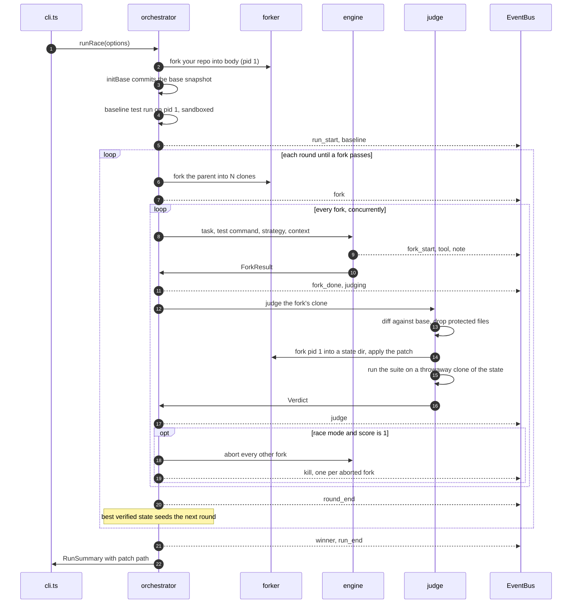
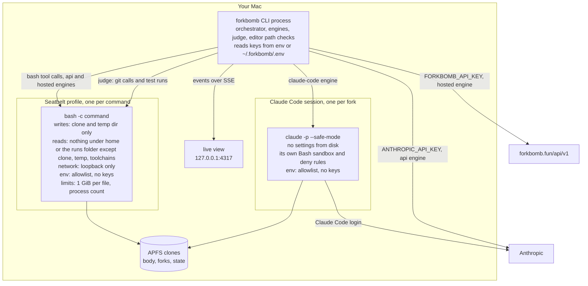
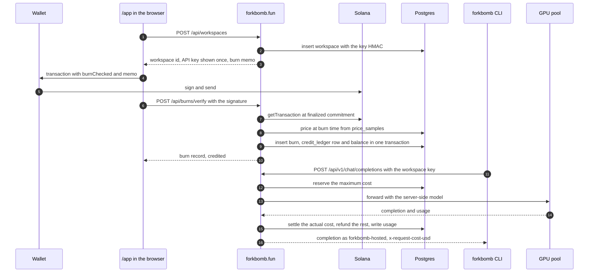

# Architecture

Forkbomb has two halves. The **CLI** (`src/`, `native/`, `ui/`) runs on your Mac and does all of the agent work: it forks the repo, runs every fork in a sandbox, judges the patches and keeps the winner. The **web side** (`web/`) is forkbomb.fun: the site, the wallet app, and the hosted API that the `hosted` engine talks to. The CLI needs the web side only when you pick `--engine hosted`.

This document describes the code as it is in 0.1.0. File paths are the source of truth; when this page and the code disagree, the code wins.

## At a glance

| What | Number | Source |
|---|---|---|
| Fork cost, clonefile vs copy | 45 ms vs 1,108 ms per fork | `forkbomb bench`, 16 forks of an 80 MB, 4,400-file `node_modules` tree, MacBook Air (M2, 24 GB) |
| Extra disk for those 16 forks | 22 MB vs 1.3 GB | same run |
| Recorded race (2026-10-05, Claude Code on a Max plan) | 4 forks cloned in 1.13 ms each, baseline 4/14, fork 1.04 passed 14/14 with a 94-line patch, 3 forks killed, 38.7 s | `web/app/config.ts` `RUN`, replay at forkbomb.fun/replay |
| First hosted race (2026-10-07) | 4 forks cloned in 0.40 ms each, fork 1.03 passed 14/14 with a 92-line patch, 3 forks killed, 4 min 33 s, $0.09 of operator-granted test credit billed | run `20261007-015122`, log in [`docs/runs/`](runs/20261007-015122/events.jsonl) |
| Forks per round | 1 to 64 | `src/cli.ts` |

## Source map

| Path | Role |
|---|---|
| `src/cli.ts` | Commands, flag parsing, engine preflight, terminal narration |
| `src/orchestrator.ts` | The run loop: pid 1, baseline, rounds, fork, race, judge, kill, carry-over, cleanup |
| `src/fork/forker.ts`, `native/hclone.c` | The `Forker` interface: APFS `clonefile(2)` and the plain-copy fallback |
| `src/sandbox.ts` | Seatbelt profile, clean environment, `runSandboxed()` |
| `src/tools.ts` | `Workspace`: the `bash` tool and the text editor, with path confinement |
| `src/agent.ts` | `api` engine tool loop on the Anthropic Messages API, and the fork system prompt |
| `src/engines/claude-code.ts` | `claude-code` engine: headless Claude Code driver and its isolation settings |
| `src/engines/canary.ts` | Isolation canary for the `claude-code` engine |
| `src/engines/hosted.ts` | `hosted` engine: OpenAI-compatible client and tool loop |
| `src/judge.ts` | Patch extraction, fresh-clone test run, test-output parsers, scoring |
| `src/strategies.ts` | The twelve fork strategies |
| `src/events.ts` | The `RunEvent` union and the `EventBus` |
| `src/server.ts`, `ui/` | Live process tree (SSE) and replay viewer |
| `src/bench.ts` | `forkbomb bench`: clonefile against copy |
| `src/procs.ts` | Registry of live child process groups, so an interrupted run leaves nothing behind |
| `src/pricing.ts` | Per-token list prices for `api` engine cost estimates |
| `src/brand.ts` | Product name, slug and the env variable names derived from it |
| `web/lib/server/` | Gateway, credits, burn verifier, price sampler, keys, rate limits, database |
| `web/app/api/` | Route handlers for the hosted API, burns, ledger, price, token and cron |
| `web/app/app/` | The wallet app at `/app` |
| `web/db/migrations/` | Postgres schema |
| `ops/devnet-burn-e2e.ts` | End-to-end burn verification on Solana devnet against the real server code |

## The run loop

`runRace()` in `src/orchestrator.ts` owns a run from start to finish. `src/cli.ts` validates every flag first, before any network call, canary or run folder, then checks the engine: Claude Code must be installed and logged in (and pass the canary, see below), the `api` engine needs `ANTHROPIC_API_KEY` and checks it with one free `models.list` call (a 401 or 403 stops the run there), and the `hosted` engine calls `GET /api/v1/me` and refuses to start with an empty balance. The run folder is `<runs>/<id>`, where the id is the start time to the second; a second run in the same second gets `-2`, created with a non-recursive `mkdir` so two runs never share a folder.

1. **pid 1.** The user's repo is forked into `<run>/body`. `initBase()` snapshots it as a commit every fork shares. A `.git` *file* (worktree or submodule) is removed first so nothing is written into another repo, and git runs with hooks, fsmonitor, GPG signing and system config turned off.
2. **Baseline.** The test command runs once on pid 1, sandboxed. The pass/fail counts become the baseline total that later guards against deleted tests. If the suite already passes, the run ends there. If the command itself is broken (`brokenTestCommand()`: exit 126 or 127, an npm, pnpm or yarn script that doesn't exist, or a suite that printed its results and then never exited), no fork starts and the run says to check `--test`. A suite that timed out without printing results still races, with a warning, since the hang may be the bug.
3. **Fork.** Each round forks the current parent into N clones with ids `<round>.<NN>`. The `fork` event records the time per clone, the logical size and the physical cost (free-space delta on the volume).
4. **Race.** Every fork starts at once. Fork *i* gets strategy `(i + (round - 1) * N) mod 12`, a per-fork timeout (`--fork-timeout`, default 600 s), and a prompt with the task, the test command, its strategy brief and, from round 2, where the previous round's best fork left off. `--concurrency` (default 8) caps how many forks talk to a model at once.
5. **Judge.** When a fork's engine returns, the judge scores the patch it would ship (see [The judge](#the-judge)). A fork that hit its timeout is still judged, on a fresh signal.
6. **Kill.** In `race` mode the first fork to score 1 wins: every fork that is still running or judging is aborted and gets a `kill` event. In `best` mode every fork finishes and the best is picked by score, then the smallest diff, then the earliest finish.
7. **Grow.** If no fork passes, the round's best verified state (pid 1 plus its patch) becomes the parent of the next round, but only if it beat the parent's score. Rounds stop at `--rounds` (default 2), on a winner, when hosted credit runs out, or when the run is halted (below).
8. **Finish.** The winning patch is written to `winner.patch`, or, when nothing passed, the best partial patch to `best.patch`, but only if it did better than the baseline: a fork that didn't improve on the unchanged repo isn't called "best". `--apply` runs `git apply` against your repo, prefixed with the repo's subdirectory when it sits inside a larger git tree. Losing clones and their states are deleted unless `--keep-forks`; per-fork temp dirs always are.

**Halting.** Three things stop every fork at once, with a `kill` event for each one still running or judging: an interrupt (`RunOptions.signal`, which the CLI aborts on Ctrl-C, `SIGTERM` or `SIGHUP`), a fork whose engine reports a rejected key (`ForkResult.fatal`: a 401 or 403 from the Anthropic API or the hosted gateway), and free disk space falling below a floor (1 GiB, or half of what was free at the start if that is less), checked before each round and every 2 s during one. An interrupted run applies nothing, still cleans up per `--keep-forks`, and ends with `run_end.interrupted`. The CLI exits 128 + the signal number (130 for Ctrl-C); a second Ctrl-C, or 5 s without the run ending, kills every tracked process group outright. An `exit` handler in `src/cli.ts` kills every group in `src/procs.ts` however the CLI exits, so no fork, test run or Claude Code session outlives it.



### Run directory

```
~/.forkbomb/runs/<id>/          FORKBOMB_HOME moves ~/.forkbomb
  events.jsonl                  every event, one JSON object per line
  body/                         pid 1: clone of your repo plus the base commit
  forks/<round>.<NN>/           one clone per fork
  state/<round>.<NN>/           pid 1 plus that fork's patch, as verified by the judge
  winner.patch | best.patch
  tmp/                          per-fork TMPDIRs, removed at the end of the run
```

At the end of a run, pid 1, the final fork's clone and its state stay on disk. Everything else from losing forks is removed unless `--keep-forks` is set.

## Forking

Everything that copies a tree goes through one interface, `Forker.fork(src, dsts[])` in `src/fork/forker.ts`. pid 1, every round's forks, and the judge's state and test dirs are all forks.

- **`apfs-clonefile`.** `native/hclone.c` is a 50-line C program: `hclone SRC DST [DST...]` calls `clonefile(2)` with `CLONE_NOFOLLOW` once per destination, times each call with `CLOCK_MONOTONIC`, and prints a JSON array of `{dst, ms, ok, err}`. One process clones the whole round. On APFS a clone shares every data block with its source until one side writes, so a fork costs metadata, not a copy. The helper is compiled with `/usr/bin/clang -O2` on first use and cached as `<home>/bin/hclone-<hash of the source>`, so every checkout of the same source shares one binary and an edit rebuilds it. It runs once right after compiling, so macOS's first-launch check of a new binary (100+ ms) never lands inside a timed fork; `forkbomb bench` also makes one untimed fork with each forker before measuring.
- **`copy`.** `/bin/cp -R`, one destination at a time. It is the fallback and the honest baseline in `forkbomb bench`.

`pickForker()` uses clonefile only when `canClone()` holds: macOS, source and destination on the same device, and `statfs` reporting APFS (`f_type` `0x1a`). If the helper can't be compiled it falls back to `copy`. pid 1 is chosen separately from the forks, so a repo on another volume is copied once into the run directory and every fork after that is still a clone.

## The sandbox

Every shell command a fork runs, and every test run and git call the judge makes, goes through `runSandboxed()` in `src/sandbox.ts`:

```
/usr/bin/sandbox-exec -p <profile> /bin/bash -c 'ulimit -f <1 GiB>; ulimit -u <limit>; exec /bin/bash -c "$0"' <command>
```

The profile is generated per fork by `seatbeltProfile()`:

| Area | Rule |
|---|---|
| Writes | Denied everywhere except the fork's clone, its private temp dir, and `/dev/null`, `/dev/zero`, `/dev/dtracehelper`, `/dev/tty*`, `/dev/fd/*`. `<clone>/.git` is denied for forks; only the judge's own git calls may write it. |
| Reads | File contents and extended attributes under the home folder and under the runs folder (`SandboxSpec.denyRead`) are denied, except the clone, the temp dir and common toolchain folders (`.nvm`, `.volta`, `.bun`, `.cargo`, `.rustup`, `.pyenv`, `.gradle`, `.m2`, `go`, `Library/Python` and others in `HOME_TOOLCHAINS`). So sibling forks, pid 1 and other runs stay unreadable even when `FORKBOMB_HOME` or `--runs-dir` puts runs outside the home folder. Metadata stays visible, and each parent folder of the clone is listable, so path lookups and `getcwd()` work. Other reads outside the home folder are allowed. |
| Network | Without `--network`: `(deny network*)`, then binding and inbound connections allowed on local loopback addresses and outbound connections allowed only to loopback (`network-bind`/`network-inbound` and `network-outbound` as separate rules: one `network*` rule with a `local` filter would match every outbound socket). TCP and UDP to any other address fail with `EPERM`, by IP as well as by name, and the mDNSResponder and DNS-SD services are blocked, so names don't resolve. `forkbomb doctor` checks both halves. |
| Limits | `ulimit -f` caps any one file at 1 GiB, and `ulimit -u` caps the user's process count at what it was plus 1,024 (macOS counts processes per user), so a runaway write or a fork bomb stops there. Claude Code sessions are started under the same limits. |
| Environment | `cleanEnv()` keeps only `PATH`, `HOME`, `USER`, `LOGNAME`, `LANG`, `LC_ALL` and `SHELL`. It sets `TMPDIR` to the fork's temp dir, `CI=1`, `TERM=dumb`, no color, global and system git config off, no git prompts, and points npm, pip and XDG caches and config into the temp dir. A repo's `.npmrc` can't swap the shell npm runs scripts with. No API key or token reaches a fork. |
| Processes | Each command is a detached process group, registered in `src/procs.ts`. On timeout or abort the whole group gets `SIGKILL`; when the shell exits, anything it left running in the group is killed too. Pipes get 1.5 s to drain, so a background process holding them open can't hang the fork. |
| Output | Fork commands and test runs keep at most 12,000 characters of output: the head and the tail, where errors usually are. |

`--no-sandbox` runs `/bin/bash -c` directly (with the same limits), prints a warning, and is required off macOS. Seatbelt is a macOS mechanism, not a VM: forks can read most of the filesystem outside the home folder and the runs folder, and use CPU and memory freely. Total disk use is watched by the orchestrator (see Halting), not capped per fork. The threat model is at forkbomb.fun/security.

## The tools

The `api` and `hosted` engines give each fork exactly two tools, both backed by `Workspace` in `src/tools.ts`. The `api` engine uses Anthropic's schema-less `bash_20250124` and `text_editor_20250728` (`str_replace_based_edit_tool`); the `hosted` engine declares two function tools, `bash` and `edit`, with the same behavior.

- **bash.** Each call is a fresh sandboxed shell at the clone root (`cd` doesn't carry over), with `--bash-timeout` (default 120 s). The result ends in `[exit code N]`, `[timed out after Ns]` or `[aborted]`.
- **Editor.** `view` (line numbers, line ranges, directory listings two levels deep that skip `.git`, `node_modules`, `dist`, `build`, `.next` and virtualenvs, capped at 24,000 characters), `create`, `str_replace` (exactly one match, replacement taken literally) and `insert`. Files over 2 MB are refused for viewing and editing.

The editor runs in the CLI process, outside Seatbelt, so it checks every path itself in `Workspace.resolve()`:

- Empty paths and paths with NUL bytes are rejected.
- `/workspace` maps to the clone root. Every fork sees the same virtual root, so all forks share one cached prompt prefix. Other absolute paths must already be inside the clone; relative paths resolve from the root.
- Each existing path component is `lstat`ed. Symlinks are resolved and the result is re-checked against the clone at every step, so a symlink planted by a fork's shell can't carry a write outside the clone. Broken symlinks are rejected.
- `.git` is rejected in any letter case.
- Writes refuse anything that isn't a regular file, refuse files with more than one hard link (a shell could hard-link an outside file into the clone), and open with `O_NOFOLLOW`.

## Engines

The orchestrator hands every engine the same system prompt (`systemPrompt()` in `src/agent.ts`) and the same per-fork prompt. Each engine returns a `ForkResult`: reason (`end_turn`, `max_turns`, `killed`, `refusal`, `timeout` or `error`), turns, tokens, cost and the fork's own summary. The system prompt tells each fork that copies of it are racing, that tests, test config and `.git` are read-only, that there is no network, and that it should fix the code for real and run the suite before it stops.

### `claude-code` (default)

`runClaudeCodeFork()` spawns one headless Claude Code session per fork, in the fork's clone, as its own process group:

```
claude -p --output-format stream-json --verbose --safe-mode --no-session-persistence
  --setting-sources "" --permission-mode acceptEdits --tools Bash,Read,Edit,Write,Glob,Grep
  --settings <json> --append-system-prompt <system prompt> --effort <effort> --max-turns <n> [--model <id>]
```

- **No settings from disk.** `--setting-sources ""` loads no user, project or local settings, so a repo's own `.claude/settings.json` can't loosen the rules. The session also runs with `--safe-mode` and `--no-session-persistence`.
- **Settings passed in.** `claudeSettings()` turns on Claude Code's Bash sandbox with `failIfUnavailable` and no unsandboxed escape hatch: writes in the clone and its temp dir, never `.git`, no network domains, and reads denied on a broad list of credential and personal folders (`~/.ssh`, `~/.aws`, `~/.config`, `~/.claude`, Keychains, `Library/Application Support`, shell histories, `Desktop`, `Documents`, `Downloads` and more). `keyFiles()` adds every `.env` and `*.env` file directly in `~`, in any dot-folder in `~` and in the CLI home, found by path when each fork starts; the CLI's own `.env` is listed even before it exists. Permission rules deny `Read` and `Edit` on the same list and on `.git`, and deny `WebFetch` and `WebSearch`. Only keys from the published settings schema are used, because in `-p` mode a settings block that fails validation is ignored without an error.
- **No keys in the child.** `claudeEnv()` passes an allowlist (`PATH`, `HOME`, `USER`, `LOGNAME`, `LANG`, `LC_ALL`, `LC_CTYPE`, `SHELL`, `TERM`) plus `TMPDIR` and git and npm hardening, so Claude Code runs on its subscription login.
- **Events.** The stream-json output is parsed into `tool` and `note` events. Token counts come from the final `result` message. Cost is reported as unknown: subscription usage isn't billed per token.
- **Kill.** `SIGTERM` to the process group, `SIGKILL` 2 s later.
- `--network` is not supported with this engine.

**The canary.** Before the first run on each Claude Code version (`claude --version`), `runCanary()` in `src/engines/canary.ts` starts a real headless session with the exact settings every fork gets, plus one extra denied folder holding a planted secret, and tells it to escape step by step. The result is read from the filesystem and the raw stream, never from what the model says it did. First, every escape step (2 to 7) must show up in the stream as a tool call that got a result back: a session that declines or skips a step proves nothing, so the canary is then inconclusive, fails, and caches nothing. Then six checks must all pass: writes inside the clone work; the shell can't write outside the clone; the file tools can't write outside the clone; outbound network is blocked; the planted secret never appears in the session; `.git` stays read-only. The result is written to `<home>/canary.json`, and a pass for the installed version skips the canary on later runs. `forkbomb canary` runs it on demand.

### `api`

`AnthropicModel` in `src/agent.ts` streams from the Messages API with `@anthropic-ai/sdk` (4 retries), `max_tokens` 32,000, effort from `--effort`, and prompt caching on the system prompt and the conversation. Default model `claude-opus-5-5` at `medium` effort. On models that support them it requests short progress notes between tool calls and turns them off if the account rejects them.

`runFork()` is a plain tool-use loop, at most `--max-turns` (default 30) turns. Each model call takes a slot from the run's semaphore; tool calls run one after another through the fork's `Workspace`. History is append-only, so every turn reuses the cached prefix. A `max_tokens` stop asks the model to continue with smaller edits, and any tool calls cut off by it come back as errors. Cost is estimated per response from `src/pricing.ts`, and is unknown for models not in that table.

### `hosted`

`HostedClient` in `src/engines/hosted.ts` talks to an OpenAI-compatible Chat Completions endpoint, by default `https://forkbomb.fun/api/v1` (`FORKBOMB_HOSTED_URL` overrides it).

- **The key goes to one place.** `FORKBOMB_API_KEY` is sent only in the `Authorization` header to the configured gateway. The base URL must be https (plain http is accepted only for loopback) and may not carry credentials; redirects are refused. The key is redacted from every event, log line and error.
- **The server picks the model.** Requests send `model: "hosted"` with the two tools and `tool_choice: "auto"`. Clients only ever see the model as `forkbomb-hosted`.
- **Streaming, so a kill is cheap.** Requests stream (`stream: true` with `include_usage`), and `src/engines/hosted-stream.ts` assembles the events back into one completion. A killed fork hangs up mid-answer; the gateway sees the connection close, stops the GPU and bills only what was streamed.
- **Retries.** 429, 500, 502, 504, a network error and a transient 503 (one marked `upstream_busy` or carrying `Retry-After`) are retried up to 4 times with jittered exponential backoff, honoring `Retry-After`. A 503 for an unprovisioned pool fails fast. A stream that fails partway is never sent again, with one exception: an error event that the gateway settled at zero before the model produced anything (a job still queued when the budget ran out, a pool busy or warming up) is retried like the HTTP 503 or 504 it stands for. The gateway sends its headers after a few seconds without output to hold the connection through a cold start, so those failures arrive in-stream. Any other error event mid-stream reads like the HTTP error it stands for. An answer counts as whole only once a choice carries a `finish_reason`; `[DONE]` alone is not enough, because the gateway ends every stream with one. Each request has a 10-minute ceiling.
- **Cost.** Each turn's charge is read from the settlement comment the gateway sends before `[DONE]` (or the `x-request-cost-usd` header on a JSON answer). A turn that fails mid-stream is still billed for what it generated, and the client reads that settlement before giving up. A turn the client hangs up on (a killed or timed-out fork, a lost connection) is billed too, but settled after the client is gone, so `hungUpCostUsd()` works it out the way the gateway does: the usage chunk if it arrived, otherwise the gateway's input estimate over the request body plus the output that had streamed (bytes / 3, at least a token per delta), at the prices `/me` reported, rounded up to a micro-USD. That part is `fork_done.costEstimatedUsd`. The run reads the balance before the first round and, if anything was estimated, again once the gateway has settled (`chargedSince()`, polling for up to 6 s while hung-up turns still hold their reservations); a drop that fits becomes the exact `run_end.costUsd`, otherwise the estimate stands with `run_end.costApprox`.
- **Shared credit gate.** The first fork to get a 402 records it on the run's `CreditGate`; no fork makes another call and no new round starts.

`runHostedFork()` mirrors the `api` loop over Chat Completions: tool calls without an id get one, `content_filter` ends the fork as a refusal, and `length` is handled like `max_tokens`. The GPU pool is live; credit opens when $FORKBOMB launches. The first hosted race, on 2026-10-07 (run `20261007-015122`), ran 4 forks, passed 14/14 and was billed $0.09 of operator-granted test credit.

## The judge

`judge()` in `src/judge.ts` scores a fork by the patch it would ship, never by the state of its workspace. The fork's clone is untrusted, so every git call against it runs inside the sandbox with network off and `core.fsmonitor=false`, `core.hooksPath=/dev/null`, pager and color off. A fork can't plant a hook or fsmonitor config that runs while it is judged.

1. **Changed files.** `git diff --name-only <base>` plus untracked files that aren't ignored. Edits to ignored paths (`node_modules`, build output) never enter the patch.
2. **Protected files.** Changed files matching the protect globs are recorded as `tampered` and excluded from the patch. The defaults (`DEFAULT_PROTECT`) cover test and spec files, `test/`, `tests/` and `__tests__/` folders, Python and Go test files, `conftest.py`, package manifests and lockfiles, vitest, vite, jest, mocha, karma, playwright, cypress and pytest config, setup files by their usual names (`vitest.setup.*`, `jest.setup.*`, `setupTests.*`), compiler and transpiler config (`tsconfig*.json`, `jsconfig*.json`, Babel, SWC), `.npmrc`, `pyproject.toml`, `setup.cfg`, `tox.ini`, `noxfile.py`, `sitecustomize.py`, `Cargo.toml`, `go.mod`, `Makefile` and their JVM, Ruby and PHP counterparts. On top of the globs, `testInfraFiles()` finds the files a given test command runs or loads that no glob names: a script in the command itself (`node runner.mjs`, `--import ./setup.mjs`), the same in the package.json scripts it runs (`test`, `pretest`, `posttest` and any script they chain), and setup files named in the runner's config (`setupFiles`, `globalSetup`, mocha `require`, and so on). The run logs which files that added. `--protect GLOB` adds more; `--no-default-protect` drops all of it. Code under test still runs inside the test process, so a patch to a source file can still tamper with the test run itself (for example by patching the assertion library); read the winning patch.
3. **Patch.** `git add -A`, then a binary `git diff --cached` against the base with the protected paths excluded. `--numstat` gives the diff size and file count.
4. **Fresh clone.** pid 1 is forked into `state/<id>` and the patch is applied there with `git apply`. A patch that doesn't apply scores 0.
5. **Test run.** The state is forked once more into a throwaway dir, the test command runs there, sandboxed (`--test-timeout`, default 300 s), and the throwaway dir is deleted. The state stays clean and can seed the next round.
6. **Score.** `parseCounts()` reads the last summary line from node:test, vitest, jest, cargo, pytest, mocha, unittest or go test. `score()` returns:
   - **1** for exit code 0 with no failures, unless fewer tests ran than in the baseline. Then the run scores `0.99 × total / baseline total`, so deleting tests can't produce a pass.
   - **Partial credit** of `0.99 × passed / expected` when tests fail, where expected is the larger of the baseline and current totals.
   - **0** on a timeout, an abort, or a failing run with no readable counts.

## The event log

Every state change in a run is a `RunEvent` (the union in `src/events.ts`), emitted through one `EventBus`. The bus stamps each event with `t`, milliseconds since the bus was created, appends it to `events.jsonl` synchronously, and fans it out to listeners: the terminal narration in `src/cli.ts` and, with `--ui`, the live view. Events carry no version field; `type` is the discriminator, and the TypeScript union is the schema.

| `type` | When | Fields besides `type` and `t` |
|---|---|---|
| `run_start` | Before the baseline | `runId`, `task`, `testCmd`, `forks`, `rounds`, `model`, `engine` (`api`, `claude-code`, `hosted`), `effort`, `mode` (`race`, `best`), `repo`, `forker`, `sandbox`, `network` |
| `baseline` | After the suite runs on pid 1 | `passed`, `failed`, `exitCode`, `score`, `outputTail` |
| `fork` | A round's clones exist | `round`, `parent`, `forks` (ids), `msEach`, `workspaceBytes`, `logicalBytes`, `physicalBytes`, `forker` |
| `fork_start` | A fork gets its strategy | `fork`, `round`, `parent`, `strategy`, `brief` |
| `tool` | A tool call returns | `fork`, `tool` (`bash`, `edit`), `summary`, `ok`, `ms` |
| `note` | The model writes text or a progress note | `fork`, `text` (up to 280 characters) |
| `fork_done` | The engine returns | `fork`, `reason`, `turns`, `inputTokens`, `outputTokens`, `costUsd`, `summary`, optional `costEstimatedUsd`, `error`, `fatal` |
| `judging` | The judge starts on a fork | `fork` |
| `judge` | The judge returns a verdict | `fork`, `passed`, `failed`, `exitCode`, `score`, `diffLines`, `filesChanged`, `tampered`, `outputTail` |
| `kill` | A race winner, an interrupt, a rejected key or a nearly full disk aborts a fork | `fork`, `why` |
| `round_end` | Every fork in the round has settled | `round`, `best`, `bestScore` |
| `winner` | A fork scored 1 | `fork`, `round`, `score`, `diffLines`, `filesChanged`, `patch`, `summary` |
| `run_end` | Last event of the run | `ok`, `ms`, `costUsd`, `applied`, `patchPath`, `best`, `bestScore`, optional `costApprox`, `interrupted` |
| `log` | Warnings and errors worth showing | `level` (`info`, `warn`, `error`), `msg` |

`parseEventLog()` reads a log back for `replay` and `export`. It rejects the first line that isn't JSON, has an unknown `type`, or lacks a field the viewer needs, so a log the viewer can't play is refused instead of exported.

pid 1 appears as `body` in `parent` fields. `costUsd` on `run_end` is null when any fork's cost is unknown, which is always the case on the `claude-code` engine. The `winner` event carries the full patch, so a recorded run replays without any other file.

**Consumers.** `src/server.ts` serves `ui/` on `127.0.0.1` (port 4317, moving to the next free port if it is taken). In live mode `/events` streams the bus over server-sent events, history first, with a ping every 15 s. In replay mode the page fetches the recorded events from `/events.json` and plays them back, with a REPLAY badge where a live run shows LIVE. Neither is readable from another site: the server answers only requests whose `Host` is `127.0.0.1:<port>` or `localhost:<port>` (which stops DNS rebinding), refuses data requests a browser marks `Sec-Fetch-Site: cross-site`, and never serves events as a script that sets a global (which any page could include with a `<script>` tag). `ui/app.js` is one code path for all of it. `forkbomb export` writes a static, self-contained replay (`index.html`, `app.js`, `style.css`, `data.js`, `events.jsonl`) you can host anywhere, with this machine's paths replaced first (`scrubPaths()`: the run folder becomes `<run>`, the repo `./<name>`, the home folder and any `/Users/<name>` `~`); forkbomb.fun/replay is one.

## Process and trust boundaries



Keys live in the CLI process only. The Anthropic key goes only to Anthropic, the hosted key only to the hosted gateway, and neither is in the environment of a fork's shell, a test run or a Claude Code session.

## The web side

`web/` is a Next.js app deployed on Vercel. Server code lives in `web/lib/server/`; route handlers in `web/app/api/` stay thin and wrap everything in `handler()`, which turns any throw into an OpenAI-shaped JSON error (`{"error": {"message", "type", "code"}}`) with no stack trace.

**Data.** Postgres through Neon when `DATABASE_URL` is set, which production requires. Without it, dev and tests use an in-memory PGlite with the migrations applied. One migration (`web/db/migrations/0001_credits.sql`) defines `workspaces`, `credit_ledger`, `burns`, `reservations`, `usage`, `price_samples` and `rate_limits`. Money is integer micro-USD everywhere, and a `CHECK` keeps every balance at zero or above.

**Keys and identity.** A workspace is a label and an API key, nothing else. Keys look like `forkbomb_sk_` plus 32 base62 characters, are shown once, and are stored only as HMAC-SHA256 under a server pepper (`KEY_PEPPER`); lookups compare hashes in constant time. Client IPs are stored only as HMACs too. Rate limits are fixed windows counted in Postgres, so they hold across serverless instances.

| Route | Auth | Purpose |
|---|---|---|
| `POST /api/workspaces` | rate limited per IP | Create a workspace; returns the key once and the burn memo |
| `GET /api/v1/me` | workspace key | Balance, per-token pricing, public model name |
| `POST /api/v1/chat/completions` | workspace key | The metered gateway |
| `GET /api/v1/usage` | workspace key | Recent requests and all-time totals |
| `POST /api/burns/verify` | rate limited per IP | Verify a burn and credit its workspace |
| `GET /api/ledger` | public | Verified burns, newest first, with totals |
| `GET /api/price` | public | Latest price sample and the 15-minute TWAP |
| `GET /api/token` | public | Mint, decimals, token program, memo prefix, whether burns are open |
| `POST /api/rpc` | rate limited per IP | Read-only Solana RPC proxy for the wallet app |
| `GET`/`POST /api/cron/price` | `CRON_SECRET` | Expire stale reservations, prune rate-limit windows, sample the price |
| `POST /api/admin/grant` | `ADMIN_SECRET` | Operator credit grant; the route answers 404 unless the secret is at least 32 characters |

### Gateway metering

`chatCompletions()` in `web/lib/server/gateway/chat.ts` runs every request through the same path:

1. **Authenticate** the Bearer key. If no upstream is configured, answer 503 before anything is charged.
2. **Rate limit** per workspace.
3. **Parse and bound.** Body up to 4 MB, at most 2,048 messages, `n` must be 1, and only an allowlist of fields is forwarded. `max_tokens` defaults to 8,192, is clamped to 32,768, and is always sent upstream, so the model can never generate more than was paid for up front. Input tokens are over-estimated from the request bytes.
4. **Reserve** the most the request can cost: one conditional `UPDATE` that debits the balance only if it covers the amount, plus a `reservations` row, in one transaction. Concurrent requests can't take a balance below zero. Short balance means a 402 with the remaining credit in a header.
5. **Call upstream** with the model replaced by the server's configured model. The call gets whatever is left of a 280 s budget and one retry on 502, 503 or a failed connection, for cold GPU workers. On RunPod serverless (`UPSTREAM_BASE_URL` of the form `https://api.runpod.ai/v2/<id>/openai/v1`) the request goes through RunPod's job queue instead of its OpenAI route (`web/lib/server/gateway/runpod.ts`): `POST /run`, then `/stream` polls for a stream or `/status` polls for a JSON answer, relayed as the same SSE or JSON an OpenAI server sends, with a keep-alive comment through a cold start. The OpenAI route keeps generating after the client hangs up; a queued job is cancelled (`POST /cancel`, tried again for up to 5 s after a 429, a 5xx or a network error) the moment a streaming client leaves or the budget runs out. Each job also carries its own `ttl` and `executionTimeout`, set to the call's remaining budget plus 10 s, so a job whose cancel never arrives still stops. Polls of one job are at least 250 ms apart even while output flows, because every request shares RunPod's per-endpoint rate limits. A 429 on a poll means back off (honoring `Retry-After`) and keep the job until the budget runs out, never a lost job. `UPSTREAM_TRANSPORT=openai` or `runpod` overrides the choice.
6. **Settle** exactly once: charge `min(actual, reserved)` from the reported usage (or an estimate from the generated bytes if upstream reported none), refund the rest, and write one `usage` row, all in one transaction. Failed calls settle at zero.

Responses carry `x-request-cost-usd`, `x-credits-remaining-usd` and `x-request-id`, and report the model as `forkbomb-hosted`. Streaming responses pass through as server-sent events with the model rewritten; the settled cost arrives as an SSE comment before `[DONE]`, and a client that disconnects stops the GPU and pays for what was streamed. Upstream errors are mapped to client-facing codes (`upstream_rejected`, `upstream_busy`, `upstream_unavailable`, `upstream_error`) and never charged. The upstream URL, host, key and model name are scrubbed from every message. If a settle fails, the cron refunds the reservation in full after `RESERVATION_TTL_MINUTES` (default 15).

### Burn verifier

`verifyBurn()` in `web/lib/server/burns.ts` turns one Solana signature into credit:

1. Reject anything that isn't a base58 signature. Until `TOKEN_MINT` is set, answer `not_configured`: burns open at launch.
2. **Idempotency.** A signature already in `burns` returns its stored record as `already_credited`.
3. Fetch the transaction at `finalized` commitment. If it's missing, `getSignatureStatuses` tells a failed transaction from one that isn't final yet or doesn't exist.
4. `parseBurnTransaction()`, a pure function, checks that the transaction succeeded and has a block time; finds `burn` and `burnChecked` instructions for the configured mint from SPL Token or Token-2022, top level or inner (CPI); cross-checks every burned account's balance change against the burned amount; and requires exactly one memo (Memo v1 or v2) for this site, exactly `forkbomb:ws_<id>`.
5. Price the burn at burn time (below), then value it in integer arithmetic: USD at 18 decimals, credit at the configured multiplier, floored to the micro-USD.
6. In one transaction, insert the burn (`ON CONFLICT (signature) DO NOTHING`) and, if it inserted and is under the per-burn cap, add it to `credit_ledger` and the workspace balance. A burn over `MAX_CREDIT_PER_BURN_USD` is recorded as `review` and credits nothing until a person looks at it. A concurrent verify of the same signature that loses the race returns the winner's record.

`credit_ledger` is append-only, and `(reason, ref)` is unique: a burn's ref is its signature and an operator grant's is `admin:<ref>`, so neither can credit twice.

The wallet app builds a transaction of exactly two instructions, `burnChecked` and the memo, so what the wallet shows is what the verifier checks. The wallet signs and sends it; the server never sees a key. The browser then polls the verifier for up to three minutes. Its Solana reads go through `/api/rpc`, which allows four read methods, pins token-account reads to the configured mint, and caps bodies at 2 KB, so the keyed RPC URL never reaches the browser.

### Price sampler

`samplePrice()` in `web/lib/server/price.ts` takes a spot quote from Jupiter, falling back to the most liquid Solana pair on DexScreener. A quote more than 5x away from the previous sample is stored only if the other source agrees within 25%. Samples land in `price_samples`.

`.github/workflows/price-sampler.yml` posts to `/api/cron/price` every 5 minutes, because Vercel's Hobby plan only runs crons daily (`web/vercel.json` keeps a daily run as a safety net). The same call expires stale reservations and prunes old rate-limit windows, and it skips sampling while `TOKEN_MINT` is unset.

`burnPrice()` never prices a burn in the burner's favor:

- The anchor is the last sample at or before the block time, and it must be at most 30 minutes old. Without one the burn is rejected (`too_old_for_price`).
- With two or more samples between 15 minutes before and 5 minutes after the burn, the price is the minimum of the anchor, the window's time-weighted average and the first sample after the burn. A burn under 10 minutes old with no later sample yet also takes a live quote into the minimum.
- With fewer samples, only a burn under 10 minutes old is priced, at the minimum of the anchor, any later sample and a live quote.

Anything observed after the burn can only push the price down.

### Ledger

`GET /api/ledger` lists verified burns newest first by block time, with cursor pagination (1 to 100 per page) and totals: tokens burned, USD value, burn count, credit issued. Workspace ids are left out. Before launch it answers an empty page without touching the database. Responses are cached at the edge for 10 seconds. The `/burns` page renders it.



Credit is consumptive: it comes in from burns (or operator grants) and leaves only as compute on the gateway. It has no cash value and is non-refundable and non-transferable.
